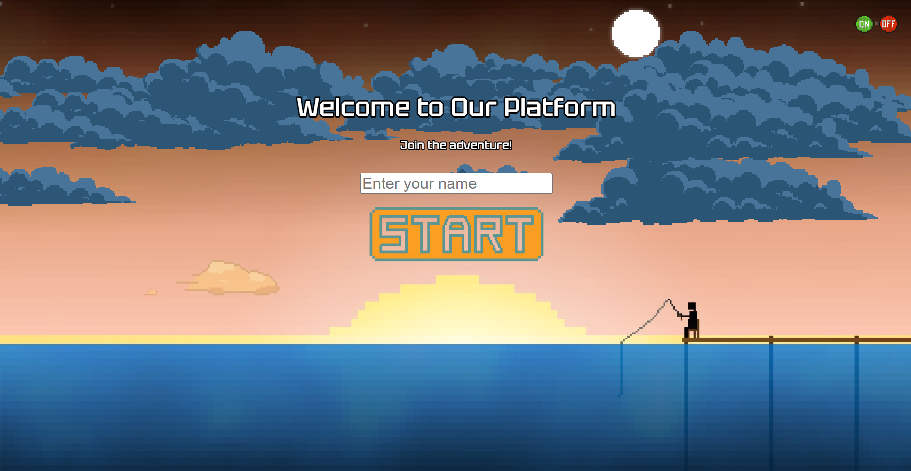
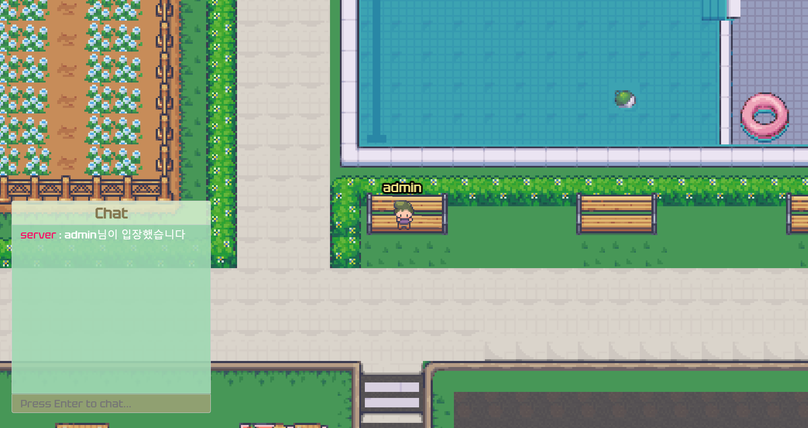

<style>


  img {
    width : 500px;
    height : 250px;
  }

  .chatimg {
    display: block;
    width : 400px;
    height : 500px;
  }

  .subtitle {
    font-size : 25px
  }

</style>

# TGI Webtaverse

- <span class="subtitle">Start Page</span>



&nbsp;

---

- <span class="subtitle">Interection</span>



&nbsp;

---

- <span class="subtitle">Text Chat</span>


## Built with

- Phaser3
- Colyseus
- Typescript

## Controls

- Arrow keys to move

- E to sit down

- Enter to open & close chat

## Prerequisites

- You'll need [Node.js](https://nodejs.org/en), [npm](https://www.npmjs.com/) installed.

## Getting Started

### Clone this repository to your local machine:

```
git clone https://github.com/T-G-I-Web/Webtaverse_Client.git
```

### To start a server, go into the project folder and install dependencies/run start command:

```
cd Webtaverse_Client or 'my-folder-name/client'

npm install && npm start
```
